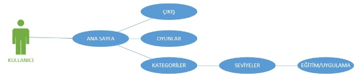
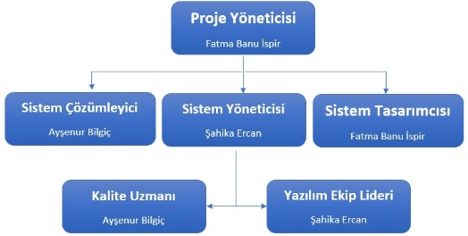
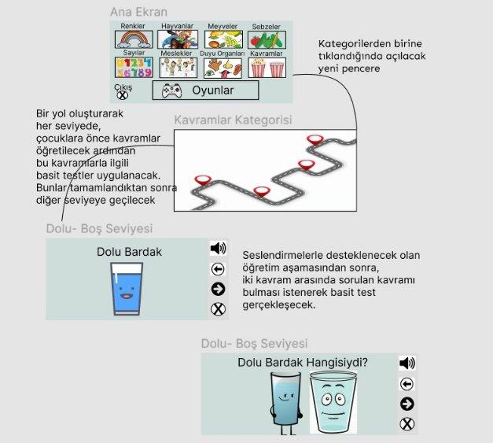
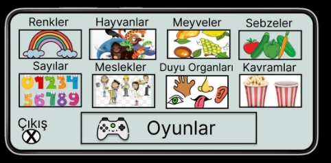
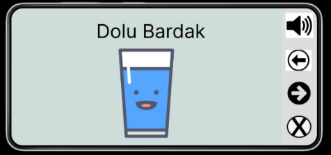
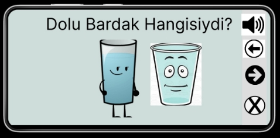
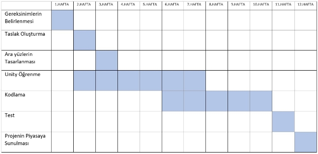
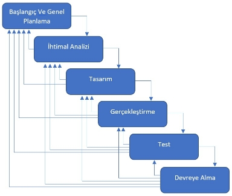

# Alkim
 Engelleri kaldıralım

**TEKNOLOJİ FAKÜLTESİ**

**YAZILIM MÜHENDİSLİĞİ**

`                 `**YMH459 YAZILIM MÜHENDİSLİĞİ GÜNCEL KONULAR**

`                             `**ENGELLERİ KALDIRALIM PROJE DÖKÜMANI**

**PROJE ADI: ALKIM**
**

**Şahika ERCAN – 18554109**

<sahika.ercan.009@gmail.com> 

**Fatma Banu İSPİR – 185541015**

<ispirbanu@gmail.com> 

**Ayşenur BİLGİÇ – 185541040**

<aysenur.bilgic.1040@gmail.com> 

**İÇİNDEKİLER**

||**Sayfa**|
| :- | :- |
|1.Giriş|3|
|1.1 Amaç|3|
|1.2 Kapsam|3|
|1.3 Dökümana Genel Bakış|4|
|2. Genel Tanım|4|
|2.1 Ürüne Bakış|4|
|2.2 Kullanıcı Özellikleri|4|
|2.3 Proje Ekip Yapısı|5|
|3. Tasarım|5|
|3.1 Uygulama Görünüm|6|
|3.2 Taşınabilirlik|7|
|4. Riskler|7|
|5. Zaman Çizelgesi|7|
|6. Ekip Durum Toplantısı|8|
|7. Eğitim Planı|8|
|8. Kullanılan Programlar|8|
|9. Kaynaklar|9|
|||

**1.Giriş**

**1.1 AMAÇ**

`      `Zihinsel engelli öğrencilerin kaliteli bir eğitim almasını sağlamak amacı ile öğretmenlere meteryal desteği sağlamakla birlikte çocuklarıyla ilgilenen ailelerin kullanabileceği aktif bir platform olacaktır. Ayrıca okul öncesi çocukların meyve, sebze gibi temel kavramları öğrenmesini eğlenceli bir yolla destekleyecektir.

Uygulamanın amacı, zihinsel engelli öğrencilere erken yaşta günlük yaşama ayak uydurmaları için destek olmaktır.

Herkesin ulaşabileceği ücretsiz bir mobil uygulama olacaktır.

**1.2 KAPSAM**

Zihinsel engelli öğrencilere eğitim veren öğretmenler ile yaptığımız toplantılar sonucunda ihtiyaç duydukları bazı temel başlıklar elde ettik. Bu başlıklar dikkate alınarak uygulamada kullanacağımız kategoriler; 

- Renkler
- Hayvanlar
- Meyveler 
- Sebzeler
- Sayılar
- Meslekler
- Kavramlar
- Duyu Organları

` `Yukarıda belirtmiş olduğumuz eğitim içeriklerini barındıracak aynı zamanda eğitimleri eğlenceli bir hale getirerek kullanıma sunulacaktır. 

`    `Eğitimleri daha eğlenceli hale getirebilmek için bazı oyunlar eklenecektir. Bunlar;

- Çizgi Takibi Oyunu
- Top Sektirme Oyunu
- Gölge Eşleştirme Oyunu
- Nesne eşleştirme Oyunu

Yukarıda belirtmiş olduğumuz oyunlar, verilen eğitimlerin içeriğini barındırmakla beraber, öğrencilerin el becerilerini, işitsel becerilerini, görsel becerilerini gibi çeşitli alanlara hitap etmesi de amaçlanmıştır. 

Çizgi takibi oyununda, öğrencilerin ve çocukların ellerini kaldırmadan çizgiyi takip etmesi istenerek, el ve göz koordinasyonu sağlaması amaçlanmaktadır.

Top sektirme oyununda, öğrencilerin ve çocukların seken top sayısını hem işitsel hem de görsel olarak gözlemlemeleri hedeflenmektedir.  

Gölge eşleştirme oyununda, öğrencilerin ve çocukların nesnelerin gölgelerini bulması ve sürükle bırak mantığıyla doğru eşleştirmeyi yapmaları hedeflenmektedir.

Nesne eşleştirme oyununda, öğrencilerin ve çocukların aynı nesneleri bulmaları ve işaretlemeleri beklenmektedir.

Yukarıda belirtilen eğitim ve oyun kategorilerini işitsel olarak seslendirmelerle destekleyerek oyunları ve eğitimi anlamaları sağlanacaktır. Böylece öğrenciler ve çocuklar hayvan sesleri gibi kavramları tanıyabilecektir. 

**1.3 DÖKÜMANA GENEL BAKIŞ**

`      `Her yıl binlerce zihinsel engelli çocuk dünyaya gelmektedir. Bireylerin gelişimi ve gelecekte yaşayacakları sorunları öğrenmeleri gereken temel kavramları öğretmek amaçlanmıştır.

`      `Zihinsel engelli öğrencilerin eğitimleri sırasında ihtiyaç duyulan materyaller çok fazla kırtasiye masrafı, zaman ve emek istemektedir. Bu süreçte hem ailelere hem de eğitmenlere destek niteliği taşıyacak olan uygulamamız ile daha zahmetsiz ve çevreci bir yaklaşımda bulunmaya çalışılmaktadır.

`     `Bireylerin eğitimlerinde toplumsal olarak sorumluluklarımız bulunmaktadır. Toplumun platforma daha rahat ulaşabilmesi için ücretsiz olarak Play Store da kullanıcılara sunularak bireylerin gelişimine katkıda bulunmak amaçlanmaktadır.

**2.GENEL TANIM**

**2.1 ÜRÜNE BAKIŞ**

- Eğitim ve oyun kategori seçme ekranı
- Eğitim seçme ekranı içerisinde alt kategoriler (renkler, sayılar vb.)
- Oyun seçme ekranı içerisinde alt kategoriler (Çizgi Takibi Oyunu vb.)
- Çıkış yapma butonu

**2.2 KULLANICI ÖZELLİKLERİ**

`         `Zihinsel engelli bireylerin eğitim gördüğü kurumlarda ki eğitimcilere ve kullanabilecek aile fertlerine hitap edecektir.

Okul öncesi çocuklara renkler, hayvanlar, meyveler, sebzeler, meslekler gibi konularda temel eğitimlerine destek vermek amaçlanmaktadır.

**2.3 PROJE EKİP YAPISI**

**3.TASARIM**

**3.1 Uygulama Görünüm**

Yapılan tasarım, uygulamanın amacını göstermek için oluşturulmuştur.

**3.2 TAŞINABİLİRLİK**

Bütün android cihazlardan erişim sağlamak amaçlanmıştır.

**4.RİSKLER**
**
`   `Proje planlanması döneminde zamanın yanlış hesaplanması ile oluşabilecek zaman kayıpları ya da kullanılan teknolojik aletlerdeki olabilecek hasarlar risklere neden olabilir.

**5.ZAMAN ÇİZELGESİ**

**6.EKİP DURUM TOPLANTISI**

`    `Discord, kütüphane, öğrenci evi vb. ortamlarda belirli saatlerde toplantılar sağlayıp proje gidişatı takibi ve de proje hakkında görüş beyanları sağlanmıştır.

**7. EĞİTİM PLANI**
**
`   `Udemy, Yotube gibi platformlardan Unity için eğitim desteği alınmaktadır.

**8. KULLANILAN PROGRAMLAR**

|**TASARIM ARAÇLARI**|**PROGRAMLAMA ARAÇLARI**|**DESTEK ARAÇLARI**|
| :-: | :-: | :-: |
|

- **Microsoft Visio 2016**

- **Figma**

|

- **Visual Studio 2019**

- **Unity**

- **Unity Hub**
|

- **GitHub**

- **Microsoft Word**

- **Google Chrome**
|

**9. KAYNAKLAR**

- [**https://www.youtube.com**](https://www.youtube.com)
- [**https://discord.com**](https://discord.com)
- [**https://github.com**](https://github.com)
- [**https://www.microsoft.com/tr-tr/microsoft-365/visio/flowchart-software**](https://www.microsoft.com/tr-tr/microsoft-365/visio/flowchart-software)
- [**https://www.figma.com**](https://www.figma.com)
- [**https://www.udemy.com**](https://www.udemy.com)

